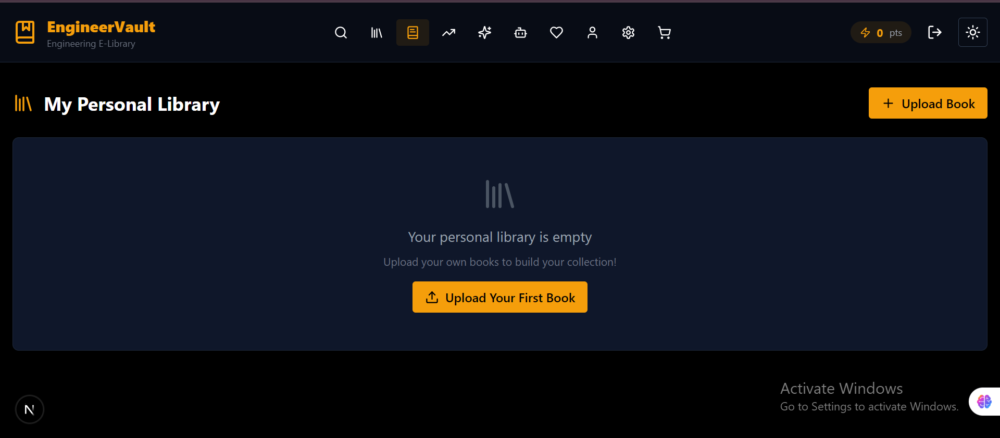
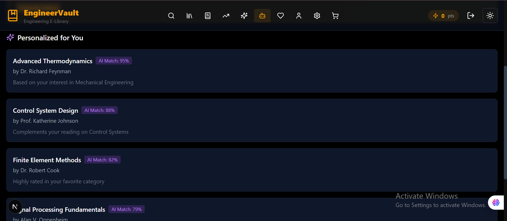
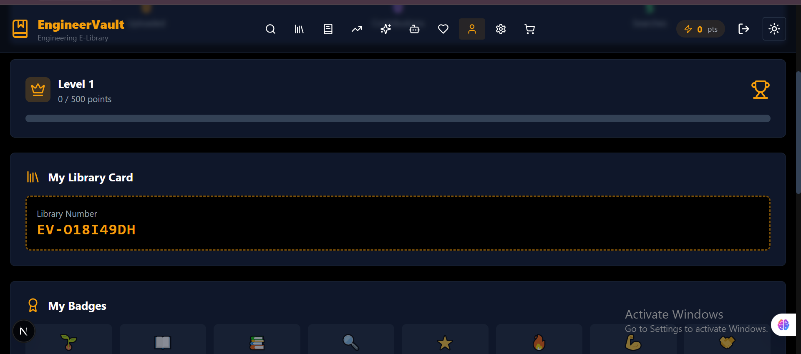

# EngineerVault

A modern web application for browsing and searching remote job listings, featuring AI-powered capabilities through HuggingFace integration, plus a personal library for engineering resources.


## Features

### Job Listings

- Browse remote jobs from the Remotive API
- Advanced search with filters (keyword, location, job type, category)
- Trending jobs based on posting recency
- Job categories with counts
- Application deadline tracking

### Personal Library

- Save and organize your favorite engineering resources
- Track reading progress with levels and points
- Earn badges for achievements
- Upload custom resources
- Curated recommendations

### AI Features

- Text generation for job descriptions
- Summarization of long content
- Sentiment analysis
- Zero-shot classification
- Text embeddings

### Technical Features

- Serverless architecture (Vercel-ready)
- In-memory caching with TTL
- Rate limiting to prevent abuse
- Comprehensive error handling
- CORS configured for Vercel and localhost
- Backup authentication system (works without Supabase)

## Screenshots

### Home Page


_The main landing page with hero section and trending content_

### Jobs Section


_Browse and filter remote job opportunities_

### Search & AI


_Advanced search with AI-powered features_

### AI Recommendations


_AI-powered book recommendations and analysis_

### Personal Library


_Your personal collection of engineering resources_

### Mobile Responsive


_Fully responsive design for all devices_

## Tech Stack

- **Frontend**: Next.js 16, React 18, TypeScript, Tailwind CSS
- **Backend**: Next.js API Routes (Serverless)
- **Database**: Supabase (optional, for future features)
- **AI/ML**: HuggingFace Inference API
- **Job Data**: Remotive API

## Project Structure

```
engineervault/
├── app/                    # Next.js app directory
│   ├── api/               # API routes
│   │   ├── auth/          # Authentication (backup system)
│   │   ├── docs/          # API documentation
│   │   ├── health/        # Health check endpoint
│   │   ├── huggingface/   # HuggingFace AI endpoints
│   │   └── jobs/          # Job listing endpoints
│   │       ├── [id]/      # Single job details
│   │       ├── categories/ # Job categories
│   │       ├── search/    # Job search
│   │       └── trending/   # Trending jobs
│   ├── globals.css        # Global styles
│   ├── layout.tsx         # Root layout
│   └── page.tsx           # Home page
├── lib/                    # Core libraries
│   ├── api/               # API utilities
│   │   ├── authService.ts # Backup authentication
│   │   ├── cache.ts       # In-memory caching
│   │   ├── cors.ts        # CORS configuration
│   │   ├── docs.ts        # API documentation
│   │   ├── errorHandler.ts# Error handling
│   │   ├── huggingfaceService.ts # HuggingFace integration
│   │   ├── rateLimiter.ts # Rate limiting
│   │   ├── remotiveService.ts # Remotive API service
│   │   └── types.ts       # TypeScript types
│   ├── api.ts             # API client
│   ├── data.ts            # Static data
│   └── supabaseClient.ts  # Supabase client
├── components/            # React components
├── public/images/          # Screenshots and images
├── .env.example           # Environment variables template
├── next.config.mjs        # Next.js configuration
├── package.json           # Dependencies
├── tailwind.config.ts    # Tailwind configuration
├── tsconfig.json          # TypeScript configuration
├── README.md              # Project documentation
└── DEPLOYMENT.md         # Deployment guide
```

## API Endpoints

### Jobs API

| Endpoint               | Method | Description                   |
| ---------------------- | ------ | ----------------------------- |
| `/api/jobs`            | GET    | List all jobs with pagination |
| `/api/jobs/search`     | GET    | Search jobs with filters      |
| `/api/jobs/categories` | GET    | Get job categories            |
| `/api/jobs/[id]`       | GET    | Get single job details        |
| `/api/jobs/trending`   | GET    | Get trending jobs             |

### AI API (HuggingFace)

| Endpoint           | Method | Description          |
| ------------------ | ------ | -------------------- |
| `/api/huggingface` | POST   | AI text operations   |
| `/api/huggingface` | GET    | Get available models |

### Authentication

| Endpoint    | Method | Description                |
| ----------- | ------ | -------------------------- |
| `/api/auth` | POST   | Register, login, or logout |
| `/api/auth` | GET    | Verify session             |

### System API

| Endpoint      | Method | Description       |
| ------------- | ------ | ----------------- |
| `/api/health` | GET    | Health check      |
| `/api/docs`   | GET    | API documentation |

## API Usage Examples

### Fetch Jobs

```bash
curl "http://localhost:3000/api/jobs?page=1&limit=20"
```

### Search Jobs

```bash
curl "http://localhost:3000/api/jobs/search?keyword=react&location=USA"
```

### Get Categories

```bash
curl "http://localhost:3000/api/jobs/categories"
```

### AI Text Generation

```bash
curl -X POST "http://localhost:3000/api/huggingface" \
  -H "Content-Type: application/json" \
  -d '{
    "action": "generate",
    "inputs": "Once upon a time in a distant land",
    "parameters": { "max_new_tokens": 50 }
  }'
```

### AI Summarization

```bash
curl -X POST "http://localhost:3000/api/huggingface" \
  -H "Content-Type: application/json" \
  -d '{
    "action": "summarize",
    "inputs": "Your long text here..."
  }'
```

### Sentiment Analysis

```bash
curl -X POST "http://localhost:3000/api/huggingface" \
  -H "Content-Type: application/json" \
  -d '{
    "action": "sentiment",
    "inputs": "I love this job opportunity!"
  }'
```

### Zero-Shot Classification

```bash
curl -X POST "http://localhost:3000/api/huggingface" \
  -H "Content-Type: application/json" \
  -d '{
    "action": "classify",
    "inputs": "This is a great opportunity for software engineers",
    "parameters": {
      "candidate_labels": ["technology", "healthcare", "finance", "education"]
    }
  }'
```

### Authentication (Register)

```bash
curl -X POST "http://localhost:3000/api/auth" \
  -H "Content-Type: application/json" \
  -d '{
    "action": "register",
    "email": "user@example.com",
    "password": "password123",
    "name": "John Doe"
  }'
```

### Authentication (Login)

```bash
curl -X POST "http://localhost:3000/api/auth" \
  -H "Content-Type: application/json" \
  -d '{
    "action": "login",
    "email": "user@example.com",
    "password": "password123"
  }'
```

## Environment Variables

Copy `.env.example` to `.env.local` and configure:

```bash
# Supabase (optional - for future auth features)
NEXT_PUBLIC_SUPABASE_URL=https://your-project.supabase.co
NEXT_PUBLIC_SUPABASE_ANON_KEY=your-anon-key

# Remotive API (optional - uses default)
REMOTIVE_API_URL=https://remotive.com/api/remote-jobs

# HuggingFace (required for AI features)
HUGGINGFACE_API_TOKEN=your-huggingface-token

# Vercel Frontend (for CORS)
VERCEL_FRONTEND_URL=https://your-project.vercel.app
```

## Getting a HuggingFace Token

1. Go to [HuggingFace Settings](https://huggingface.co/settings/tokens)
2. Create a new token with "Read" permissions
3. Add it to your environment variables

## Installation & Setup

### Prerequisites

- Node.js 18+
- npm or yarn

### Install Dependencies

```bash
npm install
```

### Run Development Server

```bash
npm run dev
```

Open [http://localhost:3000](http://localhost:3000) to view the application.

### Run Production Build

```bash
npm run build
npm start
```

## Rate Limiting

The API implements rate limiting to prevent abuse:

| Endpoint Type    | Limit       | Window   |
| ---------------- | ----------- | -------- |
| General          | 30 requests | 1 minute |
| Search           | 10 requests | 1 minute |
| Detail           | 60 requests | 1 minute |
| AI (HuggingFace) | 10 requests | 1 minute |

Rate limit headers are included in responses:

- `X-RateLimit-Limit`: Maximum requests allowed
- `X-RateLimit-Remaining`: Requests remaining
- `X-RateLimit-Reset`: When the limit resets

## Caching

The API uses in-memory caching to improve performance:

| Endpoint       | TTL        |
| -------------- | ---------- |
| Jobs List      | 3 minutes  |
| Job Details    | 10 minutes |
| Categories     | 15 minutes |
| Search Results | 2 minutes  |
| Trending Jobs  | 3 minutes  |

## Error Handling

All errors return a consistent JSON format:

```json
{
  "success": false,
  "error": {
    "statusCode": 400,
    "message": "Error message",
    "code": "ERROR_CODE",
    "timestamp": "2024-01-01T00:00:00.000Z",
    "requestId": "req_xxx"
  }
}
```

## Available AI Actions

| Action       | Description              | Parameters                          |
| ------------ | ------------------------ | ----------------------------------- |
| `generate`   | Text generation          | inputs, model, parameters           |
| `summarize`  | Text summarization       | inputs, model, parameters           |
| `translate`  | Translation              | inputs, model, parameters           |
| `sentiment`  | Sentiment analysis       | inputs, model                       |
| `embeddings` | Text embeddings          | inputs, model                       |
| `classify`   | Zero-shot classification | inputs, parameters.candidate_labels |

## User Features

### Library System

- Save books to your personal library
- Track reading progress with levels
- Earn points and unlock badges
- Get AI-powered recommendations

### Authentication

- Sign up with email and password
- Login to access personalized features
- Sessions persist across browser refreshes

## Deployment

See [DEPLOYMENT.md](DEPLOYMENT.md) for detailed deployment instructions.

## License

MIT License

---

Built with Next.js, Tailwind CSS, and ❤️
